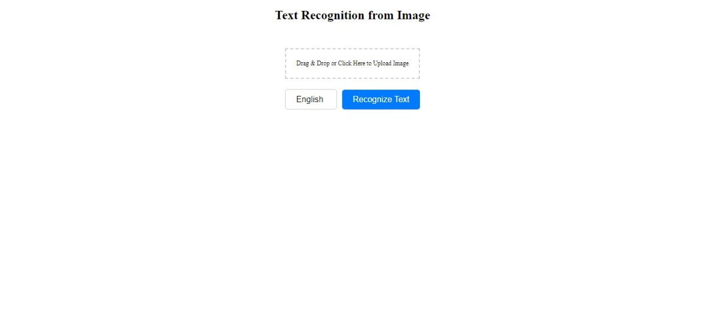

# Image Text Recognition App

This application allows users to perform text recognition on images using Tesseract.js. Users can upload images through drag-and-drop or by clicking on the upload area, select the language for text recognition (English or Russian), and then proceed to recognize the text within the image.

## Table of Contents

- [Features](#features)
- [Installation](#installation)
- [Usage](#usage)
- [Technologies Used](#technologies-used)
- [Screenshots](#screenshots)
- [Contributing](#contributing)
- [License](#license)

## Features

- Drag-and-drop or click to upload images.
- Recognize text from the uploaded image.
- Select the language for text recognition (English or Russian).
- Simple and intuitive user interface.

## Installation

1. Clone the repository:

   ```bash
   git clone https://github.com/your-username/image-text-recognition-app.git

2. Navigate to the project directory:

   ```bash
   cd image-text-recognition-app

3. Install dependencies:

   ```bash
   npm install

## Usage

1. Start the development server:
   ```bash
   npm start

2. Open your browser and navigate to http://localhost:3000.
3. Upload an image and select the language for text recognition. Click on "Recognize Text" to perform text recognition.

## Technologies Used
- React.js
- Tesseract.js

## Screenshots


## Contributing
Contributions are welcome! If you find any issues or want to contribute to this project, feel free to open an issue or submit a pull request.

## License
This project is licensed under the MIT License - see the LICENSE file for details.